# Orientações para o Hackathon

Terminou seu MVP? Agora é hora de preparar sua apresentação para o Hackathon! Aqui estão algumas orientações para ajudá-lo a subir a aplicação na nuvem da OCI e terminar de apresentar seu projeto.

## 1. Crie um Compartimento na OCI

Um Compartimento é um espaço dentro da OCI onde você pode organizar seus recursos de nuvem. Para criar um Compartimento, siga os passos abaixo:

Entre na conta da OCI e siga os passos abaixo para subir sua aplicação:

### 1.1  Entre em Identity & Security da OCI e Clique em Compartment.

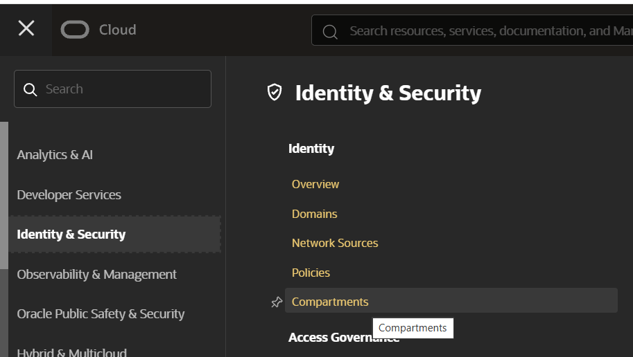

### 1.2 Clique em Create Compartment

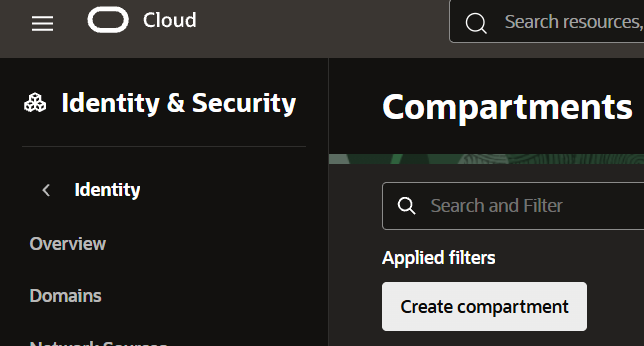

### 1.3 Preencha o nome e descrição do Compartimento e clique em Create Compartment

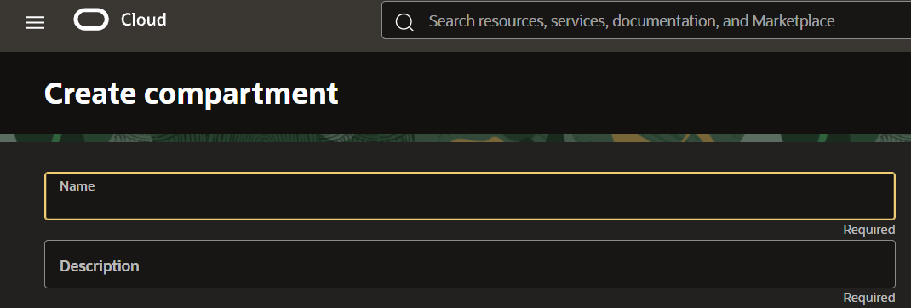

### 1.4 Clique no Compartimento criado e copie o OCID do Compartimento

Você vai precisar dele para subir sua aplicação.

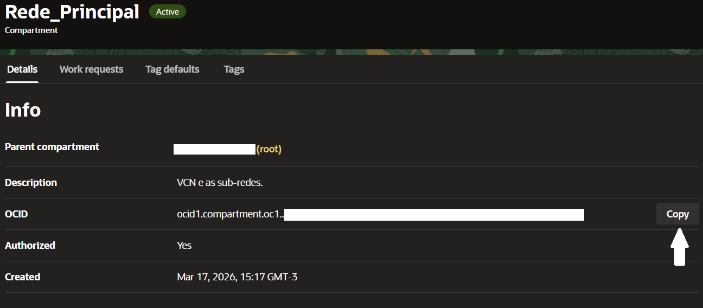

## 2. Colete seus OCIDs de User e Tenancy

O OCID (Oracle Cloud Identifier) é um identificador único para recursos na OCI. Para subir sua aplicação, você precisará do OCID do usuário e do tenancy.

### 2.1 Clique no Seu Perfil no lado superior direito da tela e em User Settings

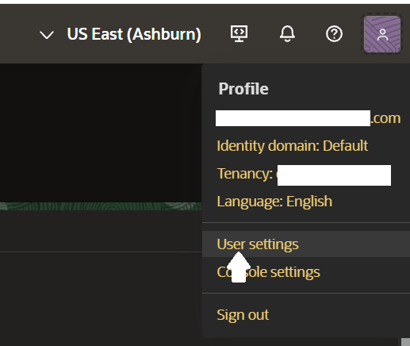

### 2.2 Copie seu OCID de usuário

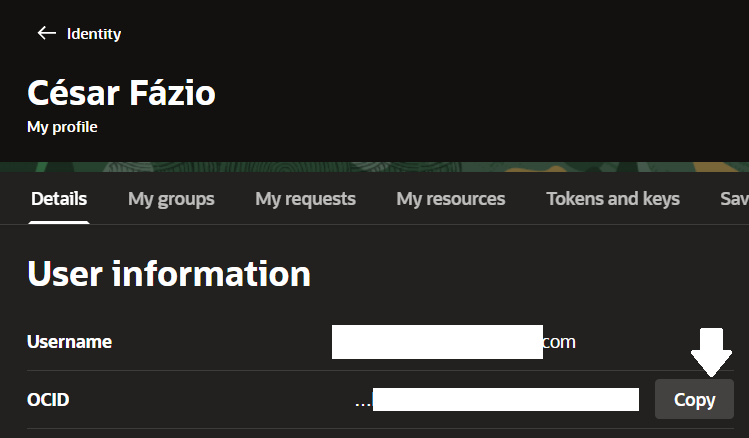

### 2.3 Clique em Tenancy e copie o OCID do Tenancy

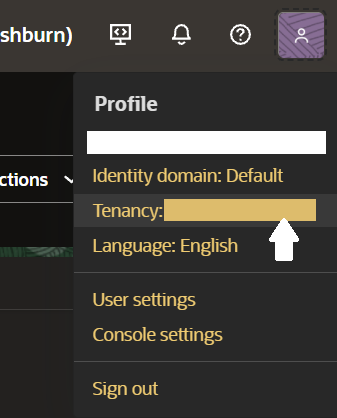
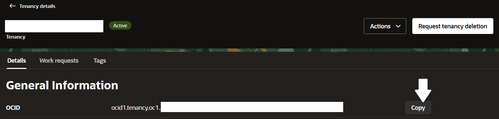

## 3. Abra o Cloud Shell

O Cloud Shell é um ambiente de linha de comando baseado em navegador que permite gerenciar recursos da OCI sem precisar instalar nada localmente. Para abrir o Cloud Shell, siga os passos abaixo:

### 3.1 Clique no ícone do Cloud Shell no canto superior direito da tela


### 3.2 Configure seu OCI CLI no Cloud Shell

```Bash
oci setup config
```
Aperte Enter: 

```Bash
Enter a location for your config [/home/seu_email/.oci/config]: 
```
Cole seu User OCID:

```Bash
Enter a user OCID: 
```
Cole seu Tenancy OCID:

```Bash
Enter a tenancy OCID: 
``` 

Digite o código da região (ex: sa-saopaulo-1) ou o índice da região (ex: 65):

```Bash
Enter a region by index or name(e.g.
1: af-casablanca-1, 2: af-johannesburg-1, 3: ap-batam-1, 4: ap-chiyoda-1, 5: ap-chuncheon-1,
6: ap-chuncheon-2, 7: ap-dcc-canberra-1, 8: ap-dcc-gazipur-1, 9: ap-delhi-1, 10: ap-hyderabad-1,
11: ap-ibaraki-1, 12: ap-kulai-2, 13: ap-melbourne-1, 14: ap-mumbai-1, 15: ap-osaka-1,
16: ap-seoul-1, 17: ap-seoul-2, 18: ap-singapore-1, 19: ap-singapore-2, 20: ap-suwon-1,
21: ap-sydney-1, 22: ap-tokyo-1, 23: ca-montreal-1, 24: ca-toronto-1, 25: eu-amsterdam-1,
26: eu-budapest-1, 27: eu-crissier-1, 28: eu-dcc-dublin-1, 29: eu-dcc-dublin-2, 30: eu-dcc-milan-1,
31: eu-dcc-milan-2, 32: eu-dcc-rating-1, 33: eu-dcc-rating-2, 34: eu-dcc-zurich-1, 35: eu-frankfurt-1,
36: eu-frankfurt-2, 37: eu-jovanovac-1, 38: eu-madrid-1, 39: eu-madrid-2, 40: eu-madrid-3,
41: eu-marseille-1, 42: eu-milan-1, 43: eu-paris-1, 44: eu-stockholm-1, 45: eu-turin-1,
46: eu-zurich-1, 47: il-jerusalem-1, 48: me-abudhabi-1, 49: me-abudhabi-2, 50: me-abudhabi-3,
51: me-abudhabi-4, 52: me-alain-1, 53: me-alrayyan-1, 54: me-dcc-doha-1, 55: me-dcc-muscat-1,
56: me-dubai-1, 57: me-ibri-1, 58: me-jeddah-1, 59: me-riyadh-1, 60: mx-monterrey-1,
61: mx-queretaro-1, 62: sa-bogota-1, 63: sa-riodejaneiro-1, 64: sa-santiago-1, 65: sa-saopaulo-1,
66: sa-valparaiso-1, 67: sa-vinhedo-1, 68: uk-cardiff-1, 69: uk-gov-cardiff-1, 70: uk-gov-london-1,
71: uk-london-1, 72: us-ashburn-1, 73: us-ashburn-2, 74: us-chicago-1, 75: us-gov-ashburn-1,
76: us-gov-chicago-1, 77: us-gov-phoenix-1, 78: us-langley-1, 79: us-luke-1, 80: us-newark-1,
81: us-phoenix-1, 82: us-saltlake-2, 83: us-sanjose-1, 84: us-somerset-1, 85: us-thames-1): 
```

Digite Y para confirmar a criação de chaves SSH (usaremos ela):

```Bash
Do you want to generate a new API Signing RSA key pair? (If you decline you will be asked to supply the path to an existing key.) [Y/n]: 
```

Aperte Enter para aceitar o caminho padrão do arquivo de chave privada:

```Bash
Enter a directory for your keys to be created [/home/seu_email/.oci]: 
```
Aperte Enter para aceitar o nome padrão do arquivo de chave pública (precisamos do nome padrão):

```Bash
Enter a name for your key [oci_api_key]:
```

Digite N/A para evitarmos passphrase (não é necessário para o Hackathon):

```Bash
Enter a passphrase for your private key ("N/A" for no passphrase): 
```

Digite N/A mais uma vez:
```Bash
Repeat for confirmation: 
```

### 3.3 Guarde o Fingerprint

```Bash
fingerprint      = "xx:xx:xx:xx:xx:xx:xx:xx:xx:xx:xx:xx:xx:xx:xx:xx" # substitua pelo seu fingerprint
```

Configurado!

### 3.4 Git Clone no nosso repositório

```Bash
git clone https://github.com/ShlomoChanoch/hackathon-health
```

### 3.5 Encontre seu IP e guarde este valor:

```Bash
curl -s4 ifconfig.me | sed 's/$/\/32/'
```

## 4. Abra o Code Editor

### 4.1 Clique no ícone do Code Editor no canto superior direito da tela

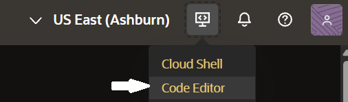

### 4.2 File > Open ou Ctrl + Alt + O e abra a pasta hackathon-health

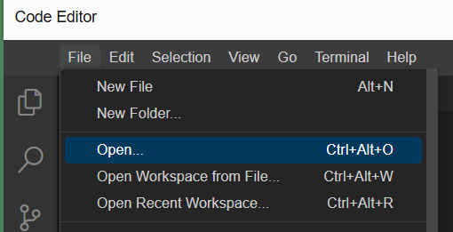

### 4.3 Abra o `arquivo tfvars.exemplo` e preencha os campos que você copiou anteriormente.

```Bash
tenancy_ocid     = "ocid1.tenancy.oc1.."
user_ocid        = "ocid1.user.oc1.."
fingerprint      = "xx:xx:xx:xx:xx:xx:xx:xx:xx:xx:xx:xx:xx:xx:xx:xx" # substitua pelo seu fingerprint
private_key_path = "~/.oci/oci_api_key.pem" 
region           = "sa-saopaulo-1"
compartment_ocid = "ocid1.compartment.oc1.."

ssh_cidr  = "000.000.000.000/32" # O valor do seu IP que você guardou anteriormente
demo_port = 8080               # --demo-port
shape     = "VM.Standard.A1.Flex" # mude a Shape caso dê erro de "Out of Capacity"
ocpus     = 2
memory    = 8
```

### 4.4 Clique nos Papéis no canto esquerdo da tela, clique em cima de tfvars.exemplo e aperte F2 para renomear o arquivo para `terraform.tfvars`.

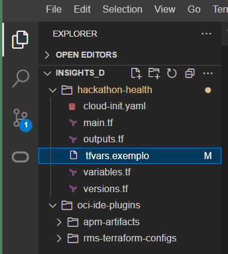
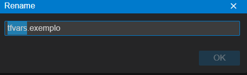

## 5. Suba sua aplicação na nuvem da OCI

### 5.1 Abra o terminal do Code Shell e rode os comandos abaixo, um de cada vez:

```Bash
cd ~/hackathon-health
terraform init
terraform fmt
terraform validate
terraform plan
terraform apply -auto-approve
```

O esperado é que você veja a seguinte mensagem no final do processo:

```Bash
Apply complete! Resources: 9 added, 0 changed, 0 destroyed.

Outputs:

instance_id = "ocid1.instance.oc1..."
public_ip = "129.213.159.186"
ssh_command = "ssh -o PubkeyAcceptedKeyTypes=+ssh-ed25519 -i ~/.ssh/health-20260916135539 ubuntu@129.213.159.186"
ssh_private_key_path = "/home/seu_user/.ssh/health-20260916135539"
ssh_user = "ubuntu"
subnet_id = "ocid1.subnet.oc1..."
vcn_id = "ocid1.vcn.oc1..."
```

### 5.2 Garanta eque as chaves SSH tenham as autorizações corretas, caso contrário você não conseguirá acessar a instância criada na OCI.

Os valores a seguir são apenas um exemplo, você deve usar os valores que apareceram no seu terminal.

```Bash
chmod 600 /home/seu_user/.ssh/health-20260916135539
```

### 5.3 Copie e cole o ssh_command no terminal do Cloud Shell para acessar a instância criada na OCI.

Os valores a seguir são apenas um exemplo, você deve usar os valores que apareceram no seu terminal.

```Bash
ssh -o PubkeyAcceptedKeyTypes=+ssh-ed25519 -i ~/.ssh/health-20260916135539 ubuntu@129.213.159.186
```

Sua instância está pronta e agora você pode acessar sua Máquina Virtual na OCI. Acesse o endereço `http://<public_ip>:8080` no seu navegador para ver sua aplicação rodando. Você pode acessar o servidor no Terminal via SSH.

Não tenha pressa em subir sua aplicação, o Hackathon vai até o final do dia. A VM pode levar alguns minutos aplicando todas as mudanças do cloud-init.yaml. Acompanhem o progresso da instalação com o comando `cloud-init status --wait`. Se a instalação não terminar, você pode reiniciar a VM com o comando `sudo reboot` e tentar acessar novamente.

Qualquer problema, informar aos monitores!

Ótimo Hackathon! Auuuuuuuu!
